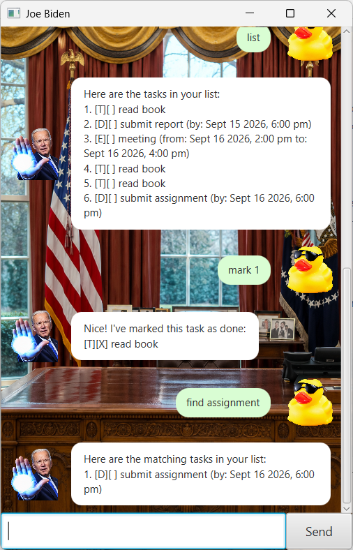

# Joe Biden User Guide

Joe Biden is a desktop task-management chatbot that helps you keep track of todos, deadlines, events, and upcoming reminders through a simple chat interface.



## Quick Start

1. Launch the application.
2. Type a command into the text box at the bottom of the window.
3. Press **Enter** or click **Send**.
4. Joe Biden will respond in the chat window.

Tasks are numbered starting from `1`. Commands such as `mark`, `unmark`, and `delete` use these task numbers.

## Features

### Adding a todo

Adds a task without a specific date or time.

**Format:**

```text
todo DESCRIPTION
```

**Example:**

```text
todo read book
```

---

### Adding a deadline

Adds a task that must be completed by a specific date and time.

**Format:**

```text
deadline DESCRIPTION /by YYYY-MM-DD HHmm
```

**Example:**

```text
deadline submit assignment /by 2026-09-16 1800
```

---

### Adding an event

Adds an event with a start and end date/time.

**Format:**

```text
event DESCRIPTION /from YYYY-MM-DD HHmm /to YYYY-MM-DD HHmm
```

**Example:**

```text
event project meeting /from 2026-09-16 1400 /to 2026-09-16 1600
```

---

### Listing tasks

Shows all tasks currently stored.

**Format:**

```text
list
```

Example output:

```text
1. [T][ ] read book
2. [D][ ] submit assignment
```

---

### Marking a task as completed

Marks the specified task as done.

**Format:**

```text
mark TASK_NUMBER
```

**Example:**

```text
mark 1
```

---

### Marking a task as not completed

Changes a completed task back to incomplete.

**Format:**

```text
unmark TASK_NUMBER
```

**Example:**

```text
unmark 1
```

---

### Deleting a task

Deletes the specified task.

**Format:**

```text
delete TASK_NUMBER
```

**Example:**

```text
delete 2
```

After deleting a task, the remaining tasks are renumbered.

---

### Finding tasks

Searches for tasks whose descriptions contain the given keyword.

The search is case-insensitive.

**Format:**

```text
find KEYWORD
```

**Example:**

```text
find assignment
```

---

### Viewing reminders

Shows incomplete deadlines and events that are happening tomorrow.

**Format:**

```text
reminders
```

Joe Biden may also display upcoming reminders when the application starts.

---

### Exiting the application

Closes Joe Biden.

**Format:**

```text
bye
```

## Error Handling

If a command is incomplete or invalid, Joe Biden displays an error message instead of terminating the application.

For example:

```text
mark 999
```

will produce an error if task `999` does not exist.

Other examples of invalid input include:

```text
todo
deadline submit assignment
deadline submit assignment /by abc
mark abc
```

Error responses are visually highlighted in the GUI so they can be distinguished easily from normal replies.

## Data Storage

Joe Biden automatically saves your tasks so that they remain available the next time the application is started.

You do not need to save your task list manually.

## Command Summary

| Action | Command |
|---|---|
| Add todo | `todo DESCRIPTION` |
| Add deadline | `deadline DESCRIPTION /by YYYY-MM-DD HHmm` |
| Add event | `event DESCRIPTION /from YYYY-MM-DD HHmm /to YYYY-MM-DD HHmm` |
| List tasks | `list` |
| Mark task | `mark TASK_NUMBER` |
| Unmark task | `unmark TASK_NUMBER` |
| Delete task | `delete TASK_NUMBER` |
| Find task | `find KEYWORD` |
| View reminders | `reminders` |
| Exit | `bye` |